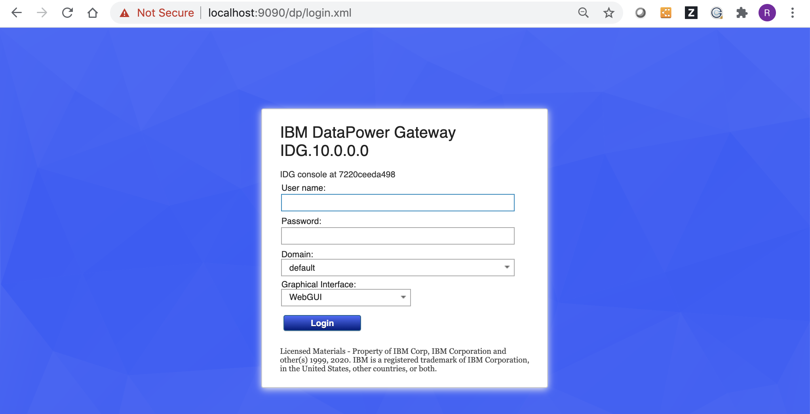
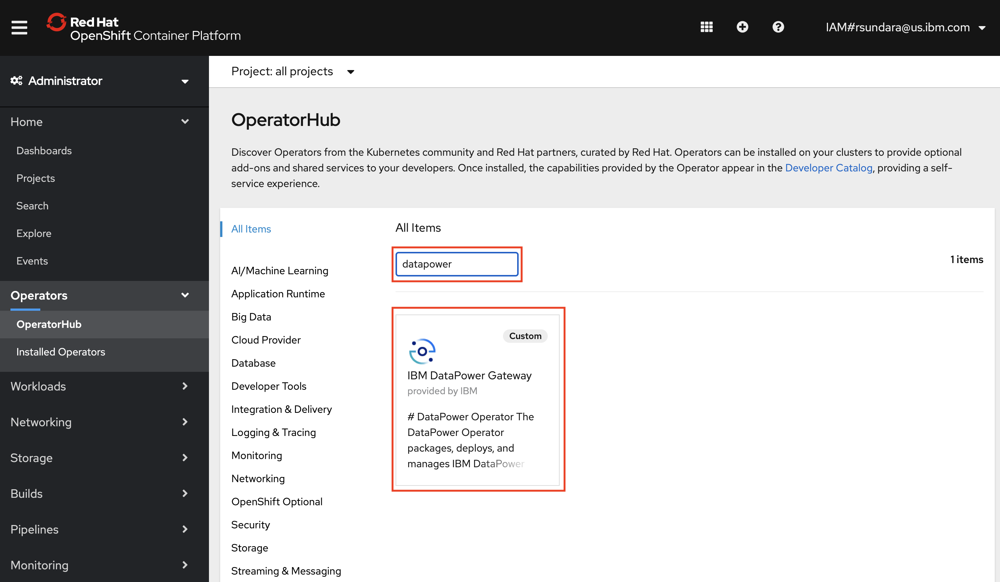
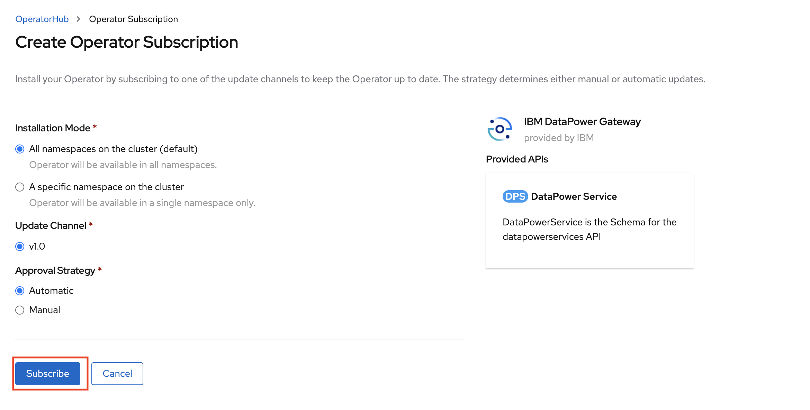
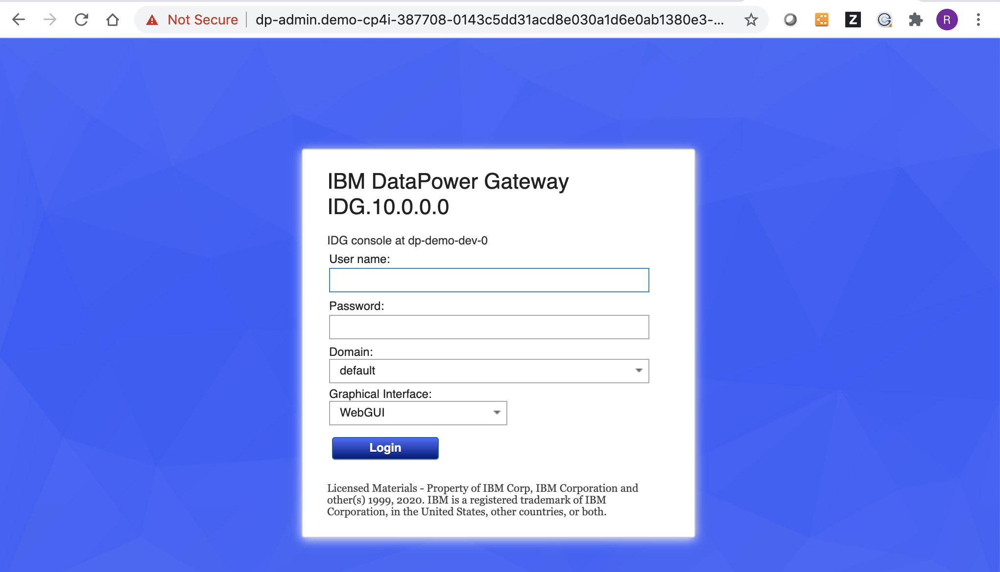

# Deploy IBM DataPowerService Custom Resource Definition in Red Hat OpenShift Cluster Platform v4.4

The [IBM DataPower operator v1.0.1](https://hub.docker.com/r/ibmcom/datapower-operator) is now available. The **IBM DataPower Operator** deploys and 
manages configurations defined by the **DataPowerService** Custom Resource specification. The documentation for the operator can be 
accessed from the link [https://ibm.github.io/datapower-operator-doc/](https://ibm.github.io/datapower-operator-doc/). 

This repository has the artifacts to deploy an **IBM DataPowerService** instance using a custom application domain in **Red Hat OpenShift Cluster Platform v4.4**. 

The following steps can be followed to deploy the **IBM DataPowerService** instance. 

1. [Setup custom repository](#1-setup-custom-repository)
2. [Test the sample DataPower application domain locally](#2-test-the-sample-datapower-application-domain-locally)
3. [Install DataPower Operator](#3-install-datapower-operator)
4. [Install DataPowerService instance](#4-install-datapowerservice-instance)
5. [Test DataPowerService instance running on OpenShift Cluster](#5-test-datapowerservice-instance-running-on-openshift-cluster)
6. [Uninstall DataPowerService instance](#6-uninstall-datapowerservice-instance) 


#### 1. Setup custom repository 

Follow [GitHub’s documentation](https://help.github.com/en/github/getting-started-with-github/fork-a-repo) on how to fork a repo to create your own fork of the **cp4i-datapower** repository.

After forking the repository, you can download the copy of your repository to the sandbox. 

Related commands are listed below.

```
cd ~
git clone git@github.com:rsundara/cp4i-datapower.git
```


#### 2. Test the sample DataPower application domain locally

For testing the sample application domain, it is required to have docker running locally in your sandbox. The link [https://docs.docker.com/get-docker/](https://docs.docker.com/get-docker/) 
can be used as a reference to jump-start the docker setup process. 

The script [testLocalDataPower.sh](./utils/testLocalDataPower.sh) can be used to test application domain locally. The script starts IBM DataPower in a container and uses local directories to load the DataPower configuration.

The following commands can be run to test the application domain locally. 

```
cd ~/cp4i-datapower/utils
./testLocalDataPower.sh
```

Sample startup log is available for reference [testLocalDataPower.log](./utils/logs/testLocalDataPower.log).

The admin access can be verified by accessing port **9090** using the link **[https://localhost:9090/](https://localhost:9090/)**

 
 
The demo service access can be verified by accessing port **6443** using the link **[https://localhost:6443/demo.html](https://localhost:6443/demo.html)**

 


#### 3. Install DataPower Operator 

The script [createCatalog.sh](./utils/createCatalog.sh) can be run to create custom catalog source.

```
cd ~/cp4i-datapower/utils
./createCatalog.sh
```

Once the custom catalog source has been created, Login to the OpenShift Cluster and using the Operator Hub, **IBM DataPower Operator** can be installed.

 
 
 
The following page will be displayed, and you can click **Subscribe** to have the IBM DataPower operator installed.
 
 


#### 4. Install DataPowerService instance 

The script [install.sh](./datapower-services/dp-demo/scripts/install.sh) can be run to install DataPowerService instance. The script
performs the following tasks:

* Create configMap to enable web-mgmt service 
* Create configMap to hold DataPower config (IDP.cfg) used by the sample application domain
* Create configMap to hold all the local files referenced  by the sample application domain
* create secrets to hold the crypto certfificate (IDP-sscert.pem) and crypto key (IDP-privkey.pem) referenced by the application domain  
* Create secret to hold the admin-credentials 
* Create Serivce to expose port 6443 and 9090
* Create Routes dp-admin and dp-demo to expose the service
* Create DataPowerService 

```
cd ~/cp4i-datapower/datapower-services/dp-demo/scripts/
./install.sh
```

Sample install log is available for reference [installDataPower.log](./datapower-services/dp-demo/scripts/logs/install.log).


#### 5. Test DataPowerService instance running on OpenShift Cluster

The following command can be run to retrieve the route for the admin service: 

```
oc get routes -n datapower | grep dp-admin | awk -F' ' '{print $2 }'
```

The admin access can be verified by accessing route for the target port **9090** using the link **[https://dp-admin.OPENSHIFT_CLUSTER_DOMAIN_SUFFIX:9090/](https://dp-admin.OPENSHIFT_CLUSTER_DOMAIN_SUFFIX:9090/)** 

 

The following command can be run to retrieve the route for the demo service: 

```
oc get routes -n datapower | grep dp-demo | awk -F' ' '{print $2 }'
```
 
The demo service can be verified by accessing route for the target port **6443** using the link **[https://dp-demo.OPENSHIFT_CLUSTER_DOMAIN_SUFFIX:6443/demo.html](https://dp-demo.OPENSHIFT_CLUSTER_DOMAIN_SUFFIX:6443/demo.html)**

 

#### 6. Uninstall DataPowerService instance 

The script [uninstall.sh](./datapower-services/dp-demo/scripts/uninstall.sh) can be run to uninstall an DataPowerService instance. The script 
deletes all of the resources (DataPowerService, ConfgMaps, Secrets, Service and Routes) created by the install script.


```
cd ~/cp4i-datapower/datapower-services/dp-demo/scripts/
./uninstall.sh
```

Sample uninstall log is available for reference [uninstallDataPower.log](./datapower-services/dp-demo/scripts/logs/uninstall.log).


#### *Note: In addition, OpenShift pipelines are available to continuously deploy IBM DataPowerSerice instance. The link listed below has more details:*

* [*Continuous deployment of DataPowerService instance using OpenShift pipeline*](./tekton/README.md)
